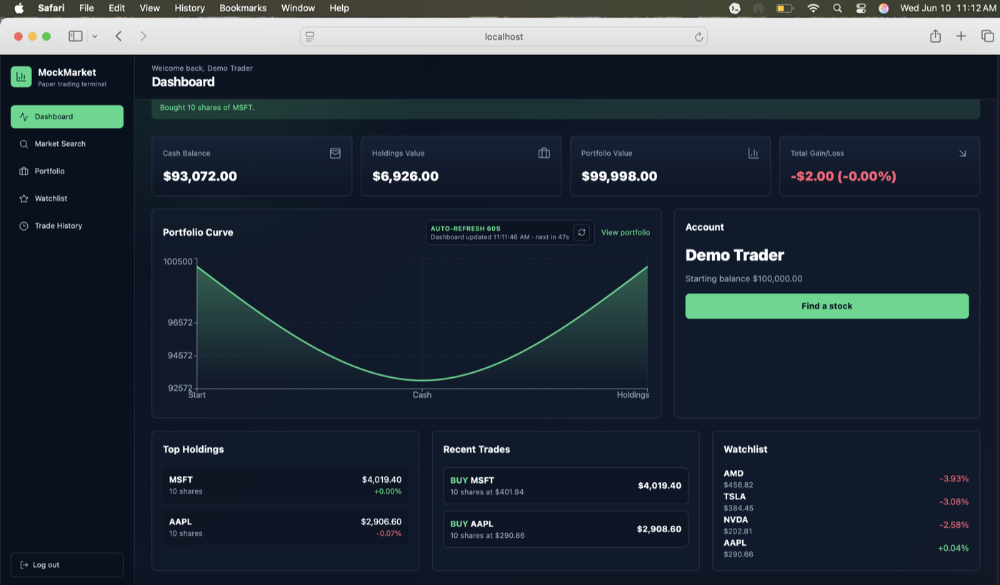
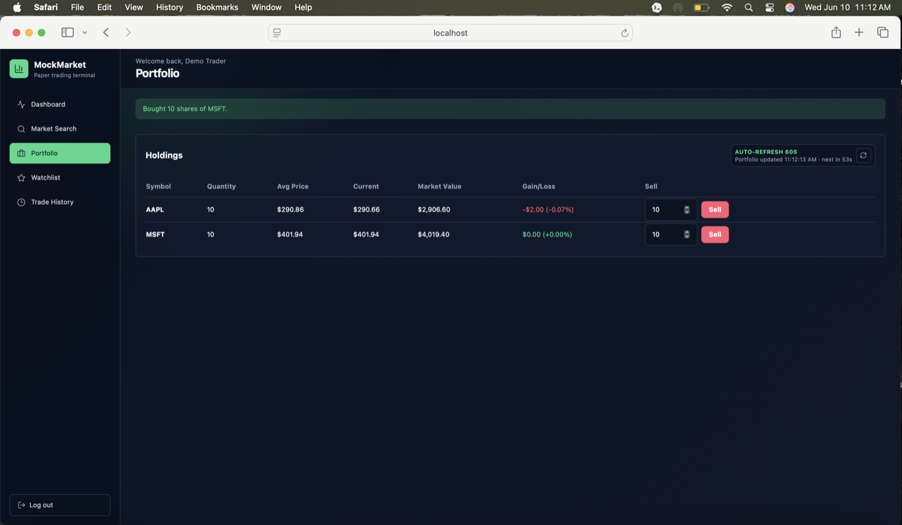
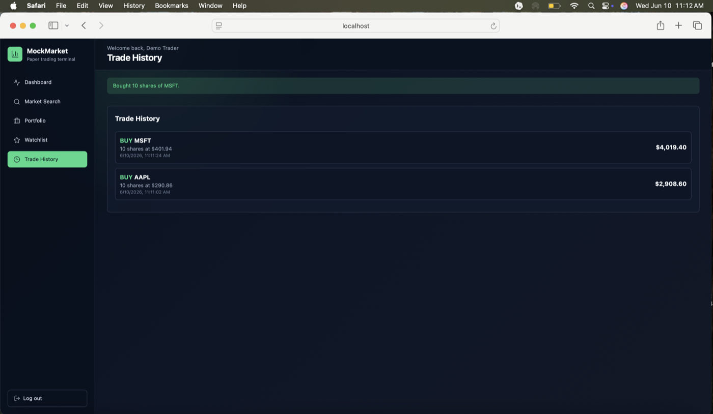
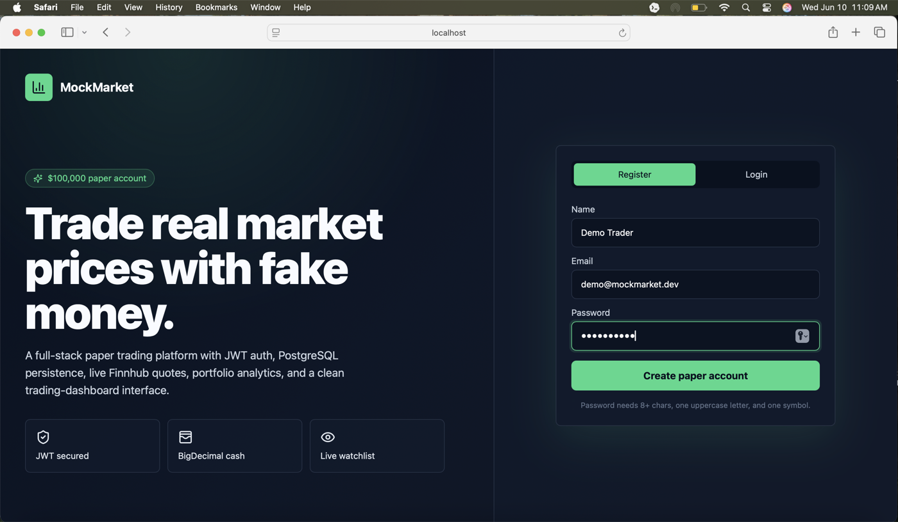

# MockMarket

MockMarket is a full-stack paper trading platform built with Java 21, Spring Boot, React, TypeScript, Tailwind CSS, PostgreSQL, JWT authentication, and Finnhub market data.

It gives each registered user a simulated `$100,000` cash account, lets them search real stock quotes, buy and sell shares with fake money, track holdings, manage a watchlist, and review transaction history.

## Screenshots

### Dashboard



### Portfolio



### Trade History



### Authentication



## Features

- Register/login with JWT authentication
- Password validation: 8+ characters, one uppercase letter, one symbol
- Automatic `$100,000` paper account on registration
- Live stock quotes and symbol search through Finnhub
- Buy and sell flow with BigDecimal money calculations
- Average cost tracking for holdings
- Portfolio summary with cash, holdings value, total value, and gain/loss
- Live quote-enriched watchlist
- Visible auto-refresh controls with countdowns and manual refresh buttons
- Trade history with BUY/SELL records
- PostgreSQL persistence with an H2 local demo profile
- Swagger/OpenAPI documentation
- Docker-ready backend and local PostgreSQL Compose file
- Vercel-ready frontend

## Tech Stack

Backend:
- Java 21
- Spring Boot
- Spring Web
- Spring Data JPA
- Spring Security
- JWT
- PostgreSQL
- H2 for local demo profile
- Springdoc OpenAPI

Frontend:
- React
- TypeScript
- Vite
- Tailwind CSS
- Recharts
- Lucide icons

## Project Structure

```text
mockmarket
├── backend
│   └── src/main/java/com/prasun/mockmarket
├── frontend
│   └── src
├── docker-compose.yml
└── README.md
```

## Local Setup

### 1. Environment

Create environment files from the examples:

```bash
cp .env.example .env
cp frontend/.env.example frontend/.env
```

Set:

```bash
FINNHUB_API_KEY=your_finnhub_key_here
JWT_SECRET=replace_with_a_long_random_secret
VITE_API_URL=http://localhost:8080
```

Never commit real API keys.

### 2. Database

Start PostgreSQL:

```bash
docker compose up -d
```

### 3. Backend

```bash
cd backend
mvn spring-boot:run
```

For a no-database local demo:

```bash
cd backend
mvn spring-boot:run -Dspring-boot.run.profiles=local
```

For local development with live Finnhub quotes:

```bash
cd backend
FINNHUB_API_KEY=your_finnhub_key_here mvn spring-boot:run -Dspring-boot.run.profiles=local
```

If `FINNHUB_API_KEY` is missing, the backend falls back to demo quote data so the app can still run.

Backend runs at:

```text
http://localhost:8080
```

Swagger UI:

```text
http://localhost:8080/swagger-ui.html
```

### 4. Frontend

```bash
cd frontend
npm install
npm run dev
```

Frontend runs at:

```text
http://localhost:5173
```

## API Overview

Auth:
- `POST /api/auth/register`
- `POST /api/auth/login`
- `GET /api/auth/me`

Market:
- `GET /api/market/quote/{symbol}`
- `GET /api/market/search?query=apple`

Account:
- `GET /api/account`

Trading:
- `POST /api/trade/buy`
- `POST /api/trade/sell`
- `GET /api/trade/history`

Portfolio:
- `GET /api/portfolio/holdings`
- `GET /api/portfolio/summary`

Watchlist:
- `GET /api/watchlist`
- `POST /api/watchlist/{symbol}`
- `DELETE /api/watchlist/{symbol}`

## Market Data Refresh

MockMarket avoids aggressive polling so it stays friendly to free API rate limits:

- Stock detail refreshes every 15 seconds
- Watchlist refreshes every 30 seconds
- Dashboard and portfolio refresh every 60 seconds
- Key screens show last-updated time, next-refresh countdown, and manual refresh controls

## Deployment

Frontend:
- Deploy `frontend/` to Vercel
- Set `VITE_API_URL` to the deployed backend URL

Backend:
- Deploy `backend/` to Render, Railway, Fly.io, or AWS
- Set `FINNHUB_API_KEY`, `JWT_SECRET`, `DATABASE_URL`, and `CORS_ALLOWED_ORIGINS`

Database:
- Use Neon, Supabase, Railway PostgreSQL, or Render PostgreSQL

## Security Notes

- Secrets are read from environment variables
- JWT protects all private user data
- Passwords are stored as BCrypt hashes
- Stack traces are hidden from API responses
- Market API keys are never sent to the frontend

## Future Improvements

- Portfolio value snapshots for richer performance charts
- Refresh tokens
- More advanced order types
- Stock news and company fundamentals
- Email verification
- End-to-end Playwright tests
